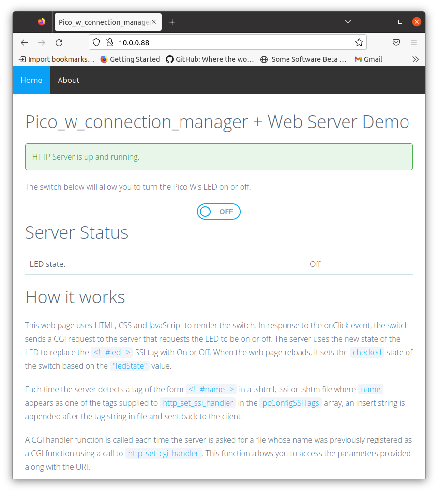

# pico-w-connection-manager-demo
Run an LwIP webserver on a Pico W using a C++ Pico_w_connection_manager class
and command line interface to manage connection to the AP.

The CLI program allows you to scan for SSID, handle connect and disconnect, read
RSSI, and store SSID info in Pico W program flash using the LittleFs file system.

The source code is designed so you can use the `Pico_w_connection_manager` Class
with your own user interface. Use the `Pico_w_connection_manager_cli` Class
as a guide. The code assumes a "super-loop" and does not use an RTOS.

Once the connection to the AP is active, the demo program starts a webserver
that allows you to turn the Pico W's on-board LED on or off.



# Demo program
The demo program uses a serial port console to accept user input and
print output. Type `help` at the command prompt for a list of commands.
All commands for managing the Wi-Fi connection are of the form `wifi-`.
The other commands are for managing the LittleFs flash file system.

The demo program uses a UART serial port console. You will need to modify
`CMakeLists.txt` if you wish to use the Pico-W's microUSB port as the
serial port console. See the comments in `CMakeLists.txt`.

# First time run
1. Normally, the Pico W will automatically connect to the last AP to which it was
connected. That doesn't work the first time. The first time you run the code, you will see something like the following on your terminal

```
pico-w-wifi-setup demo                                                        
Cli is running.                                                                 
Type "help" for a list of commands                                              
Use backspace and tab to remove chars and autocomplete                          
Use up and down arrows to recall previous commands                              
> new country code XX=Worldwide                                                 
new country code XX=Worldwide                                                   
Version: 7.95.49 (2271bb6 CY) CRC: b7a28ef3 Date: Mon 2021-11-29 22:50:27 PST U0
cyw43 loaded ok, mac 28:cd:c1:06:3d:29                                          
API: 12.2                                                                       
Data: RaspberryPi.PicoW                                                         
Compiler: 1.29.4                                                                
ClmImport: 1.47.1                                                               
Customization: v5 22/06/24                                                      
Creation: 2022-06-24 06:55:08                                                   
No SSID specified                                                               
failed to connect to
```
2. If your AP has an broadcast SSID, enter the `wifi-scan-connect` command and
follow the prompts to connect. If your AP has a hidden SSID, use the `wifi-connect`
command to connect.
3. When the connection is complete, the terminal will show a `Link Up IP address=`
message. Enter that IP address in your browser to display the home page of the
webserver.

When you toggle the switch, there will be a perceptable delay because the whole page
reloads for each CGI request.

# Dependencies
Aside from the dependencies on the Pico C/C++ SDK, the Pico_w_connection_manager class
uses the following external code:

- the `parson` JSON library to serialize and deserialize settings to JSON format
- the `LittleFs` file system to store Wi-Fi settings in JSON format to
a small reserved amount of Pico board program flash.
- the `LwIP` library for a TCP/IP stack.

The demo program uses the following external code:
- the `EmbeddedCli` library for the main CLI implementation
- a `getsn()` implementation for user input of numbers and strings in response to prompts
- the host machine must support the `perl` command in order convert the `index.html`
file to the `my_fsdata.c` file.

See the source code for more details.

# Getting the Source And Building the demo program
Make sure you have installed the `pico-sdk` and that it works.
Execute the following commands. The commands below assume that
the `pico-sdk` is stored in `${PICO_SDK_PATH}` and you want
the `pico-w-connection-manager-demo` directory at the same
directory level as the `pico-sdk`.

```
export PICO_BOARD=pico_w
cd ${PICO_SDK_PATH}/..
git clone https://github.com/rppicomidi/pico-w-connection-manager-demo.git
cd pico-w-connection-manager-demo
git submodule update --recursive --init
mkdir build
cd build
cmake ..
make
```

Load the built image into your Pico-W. If if you run into issues during testing, apply any patches described in the [Known Issues](#known-issues) section and rebuild.

# Known Issues
For all known issues, check the date. By the time you build this, they
may be fixed.
## On 6-dec-2022
### LwIP bug
If you call `initialize()` after you call `deinitialize()` then the software will hang up.
This is an issue the `pico-sdk`. To work around this issue, use the
`pico-sdk` `development` branch and patch per the discussion in [sdk issue #980](https://github.com/raspberrypi/pico-sdk/issues/980):

```
cd ${PICO_SDK_PATH}
git fetch origin
git checkout -b develop origin/develop
git submodule update lib/cyw43-driver/
```

Edit the file 'pico-sdk/src/rp2_common/pico_cyw43_arch/cyw43_arch_threadsafe_background.c`. 
Replace code near line 194

```
#if CYW43_LWIP
    lwip_init();
#endif
```

with

```
#if CYW43_LWIP
    static bool done_lwip_init;
    if (!done_lwip_init) {
        lwip_init();
        done_lwip_init = true;
    }
#endif
```
### Changing the web pages does not cause the webserver to rebuild
The web pages that the web server serves are stored in the `fsdata/fs` directory. If you change any web page or CSS file, you will need to re-run `cmake` to generate the fsdata/fsdata.c file that encodes the pages for the LwIP httpd app and run `make clean` before `make`. The build system should do this automatically, but it does not because I have not worked out how to get the dependencies correct.

# Demo program features
The demo prgram is designed to exercise features of the
`pico-w-connection-manager` class, which is called "the class" below.
## Hardware initialization
1. The User chooses Wi-Fi radio bands based on a list of supported countries that the class can supply to a user interface
2. The class initializes the Wi-Fi system with the user-selected
country code.

Commands: `wifi-country` and `wifi-initialize`.

## Hardware shutdown
1. The User requests Wi-Fi shutdown
2. The class de-initializes the Wi-Fi system.

Commands: `wifi-deinitialize`

## User-directed scan and connect workflow
1. The user recalls the last connected AP SSID info from flash and initializes Wi-Fi if required.
2. User starts a scan for available Wi-Fi access points
3. User chooses the SSID to connect from the scan list and supplies a
passphrase if required
4. The class stores the selected SSID, user-entered passphrase, and
scan-obtained security type to flash in JSON format
5. The class attempts to connect to the access point using the SSID info stored.
6. If connection succeeds, the class stores the SSID info to a list of known APs

Commands `wifi-scan-connect`

## User-directed hidden SSID connect workflow
1. User enters SSID, passphrase and security type (Open, WPA-PSK, WPA2-PSK) for the AP.
2. The class stores the SSID, passphrase, and security type to flash in JSON format
3. The class attempts to connect to the access point using the SSID info stored.
4. If connection succeeds, the class stores the SSID info to a list of known APs

Commands: `wifi-connect`
## Automatic connection
1. The class recalls the last connected AP SSID info from flash and initializes Wi-Fi if required.
2. The class attempts to connect to the access point using the SSID
info recalled.

Commands: `wifi-autoconnect`

Note: The demo program runs the equivalent of this command automatically at startup.

## Force disconnection
1. The class forces the link down if it is up, or it de-initializes and then initializes the WiFi system if the link is requesting a connection.

Commands: `wifi-disconnect`

## Link loss reconnection
1. The Wi-Fi was connected but the link went down due to AP shutdown, AP out of range, etc.
2. The class and Wi-Fi hardware automatically reconnects when the AP is back online or in range again.

Commands: none; the Pico-W will do this automatically. To cancel this
behavior, you have to explicityly run `wifi-deinitialize` or `wifi-disconnect` after link loss
